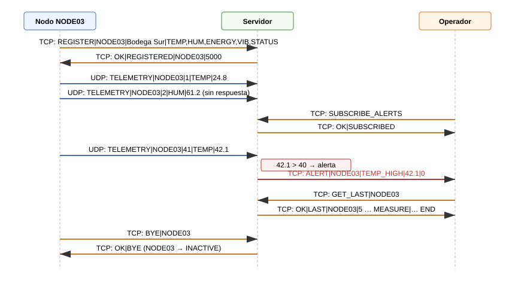
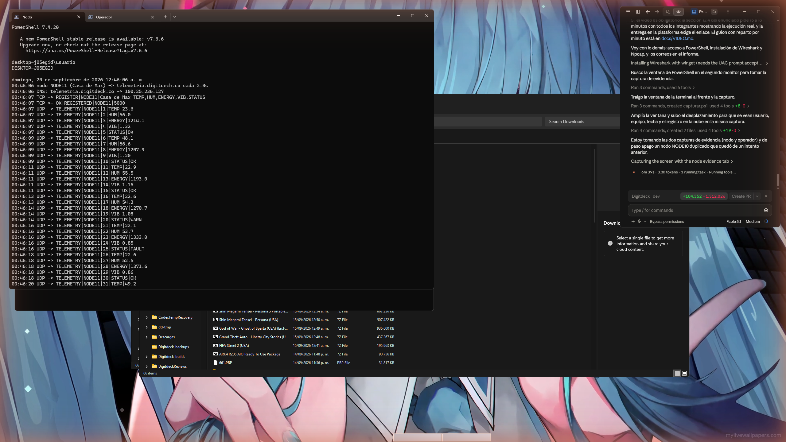

## 1. Portada e integrantes

| Integrante | Correo | Parte desarrollada |
|---|---|---|
| Maximiliano Bustamante | mbustamang@eafit.edu.co | [ajustar] |
| [Integrante 2] | [correo] | [ajustar] |
| [Integrante 3] | [correo] | [ajustar] |

Repositorio privado: https://github.com/Max-Bustamante69/Telematica-Telemetria-2026-2

Video de sustentación: [enlace]

Servidor desplegado: `telemetria.digitdeck.co` (AWS EC2, región `us-east-1`, contenedor Docker).

## 2. Introducción y descripción del problema

Una organización que administra instalaciones distribuidas necesita saber, en un solo lugar, qué está pasando en cada una: temperatura, humedad, consumo de energía, vibración de los equipos y su estado operativo. Los dispositivos están en sitios distintos, se conectan a través de Internet y pueden fallar o desconectarse. Un operador debe poder consultar el estado de cualquier dispositivo y enterarse de una condición anómala en el momento en que ocurre.

El proyecto construye esa plataforma con tres programas que se comunican por sockets:

1. Nodos de telemetría en Python que simulan dispositivos IoT. Cada uno tiene un identificador, reporta cinco variables y localiza el servidor por su nombre DNS.
2. Un servidor central escrito en C, desplegado en una instancia EC2 dentro de un contenedor Docker. Recibe telemetría por UDP, atiende operadores por TCP, detecta valores fuera de umbral, genera alertas y expone una página web.
3. Un cliente operador en Python que consulta nodos, mediciones, alertas y el estado general, y que puede suscribirse para recibir las alertas en el momento en que se generan.

La comunicación principal usa un protocolo de texto propio, TLP/1.0 (Telemetry Line Protocol), diseñado para el proyecto. HTTP se usa solo para la interfaz web, como pide el enunciado.

El informe sigue el orden de la sección 12.2 del enunciado. Todas las figuras y tablas están numeradas y explicadas.

## 3. Diagrama de arquitectura


**Figura 1.** Arquitectura del sistema. Fuente: elaboración propia.

Componentes y responsabilidades:

| Componente | Archivo | Responsabilidad |
|---|---|---|
| Hilo principal | `server/src/main.c` | Abre los tres sockets de escucha, instala los manejadores de SIGINT y SIGTERM, lanza los hilos y ejecuta el bucle `accept()` de TCP |
| Hilo UDP | `server/src/udp_telemetry.c` | `recvfrom()` en el puerto 5000, validación y procesamiento de cada datagrama, `sendto()` del NACK cuando el nodo no está registrado |
| Hilo por cliente TCP | `server/src/tcp_operator.c` | Acumula bytes hasta encontrar `\n`, procesa cada línea y envía la respuesta completa |
| Hilo HTTP | `server/src/http.c` | Servidor HTTP/1.1 mínimo sobre sockets TCP, un hilo por petición |
| Hilo watchdog | `server/src/watchdog.c` | Cada segundo revisa `last_seen` de cada nodo y marca INACTIVE a los que llevan más de 15 s sin reportar |
| Estado compartido | `server/src/state.c` | Tabla de 64 nodos, 8 variables por nodo, anillo de 256 alertas, 32 suscriptores, contadores. Un mutex protege todo |
| Protocolo | `server/src/protocol.c` | Parseo de TLP, comandos, códigos de error, umbrales de alerta, conteo de pérdidas por secuencia |
| Nodo | `node/node.py` | DNS, REGISTER por TCP, telemetría por UDP, reintentos, reregistro tras NACK, BYE al salir |
| Operador | `operator_client/operator_client.py` | Conexión TCP, menú interactivo, modo de un solo comando, hilo que escucha alertas |



**Figura 2.** Secuencia de mensajes en un ciclo típico. Fuente: elaboración propia.

## 4. Diseño y especificación del protocolo

La especificación completa está en `docs/PROTOCOLO.md`. Esta sección resume las decisiones.

### 4.1 Formato

Un mensaje es una línea de texto ASCII terminada en `\n`, con campos separados por `|`. El primer campo es el tipo. El tamaño máximo es 512 bytes. Se eligió texto y no binario porque los mensajes se leen tal cual en Wireshark, en los logs y en una sesión de `nc`, lo que facilita las pruebas y la sustentación.

```
mensaje := tipo ( "|" campo )* "\n"
```

### 4.2 Tipos de mensajes

**Tabla 1.** Mensajes del protocolo TLP/1.0.

| Origen | Mensaje | Transporte | Respuesta |
|---|---|---|---|
| Nodo | `REGISTER\|id\|ubicacion\|VARS` | TCP | `OK\|REGISTERED\|id\|5000` |
| Nodo | `TELEMETRY\|id\|seq\|VAR\|valor` | UDP | ninguna, o `NACK\|104\|NOT_REGISTERED` |
| Nodo | `BYE\|id` | TCP | `OK\|BYE` |
| Operador | `PING` | TCP | `OK\|PONG` |
| Operador | `LIST_NODES` | TCP | `OK\|NODES\|n`, n líneas `NODE\|…`, `END` |
| Operador | `GET_STATUS\|id` | TCP | `OK\|STATUS\|id\|estado\|ubicacion\|hace_s\|recibidos\|perdidos\|alertas` |
| Operador | `GET_LAST\|id` | TCP | `OK\|LAST\|id\|n`, n líneas `MEASURE\|…`, `END` |
| Operador | `GET_ALERTS[\|max]` | TCP | `OK\|ALERTS\|n`, n líneas `ALERT\|…`, `END` |
| Operador | `SYSTEM_STATUS` | TCP | `OK\|SYSTEM\|clave=valor;…` |
| Operador | `SUBSCRIBE_ALERTS` | TCP | `OK\|SUBSCRIBED` y luego `ALERT\|…` cuando ocurran |
| Operador | `QUIT` | TCP | `OK\|BYE` y cierre |
| Servidor | `ALERT\|id\|tipo\|valor\|hace_s` | TCP | (empujado a los suscritos) |

Las respuestas de varias líneas terminan con `END` para que el cliente sepa dónde acaba la respuesta sin depender de la longitud ni del cierre de la conexión.

### 4.3 Parámetros

- `id`: letras, dígitos, `_` y `-`, hasta 31 caracteres.
- `seq`: entero desde 1, crece en 1 por datagrama. Permite contar pérdidas.
- `VAR`: `TEMP`, `HUM`, `ENERGY`, `VIB`, `STATUS`.
- `valor`: número con punto decimal; para `STATUS`, uno de `OK`, `WARN`, `FAULT`.

### 4.4 Códigos de error

**Tabla 2.** Códigos de error.

| Código | Texto | Cuándo |
|---|---|---|
| 100 | BAD_FORMAT | Faltan campos |
| 101 | UNKNOWN_COMMAND | Tipo desconocido |
| 102 | UNKNOWN_NODE | El nodo consultado no existe |
| 103 | BAD_PARAM | Parámetro inválido |
| 104 | NOT_REGISTERED | Telemetría de un nodo sin REGISTER (único error que viaja por UDP) |
| 105 | TOO_LONG | Línea de más de 512 bytes |
| 106 | SERVER_FULL | Ya hay 64 nodos |

### 4.5 Alertas

**Tabla 3.** Umbrales de alerta evaluados en cada medición.

| Variable | Condición | Alerta |
|---|---|---|
| TEMP | > 40.0 o < -10.0 | TEMP_HIGH, TEMP_LOW |
| HUM | > 85.0 | HUM_HIGH |
| ENERGY | > 5000.0 | ENERGY_HIGH |
| VIB | > 8.0 | VIB_HIGH |
| STATUS | = FAULT | STATUS_FAULT |
| (tiempo) | 15 s sin telemetría | NODE_INACTIVE |

### 4.6 Ejemplo de intercambio

```
N -> S (TCP)  REGISTER|NODE03|Bodega Sur|TEMP,HUM,ENERGY,VIB,STATUS
S -> N (TCP)  OK|REGISTERED|NODE03|5000
N -> S (UDP)  TELEMETRY|NODE03|1|TEMP|24.8
N -> S (UDP)  TELEMETRY|NODE03|2|HUM|61.2
O -> S (TCP)  GET_LAST|NODE03
S -> O (TCP)  OK|LAST|NODE03|2
S -> O (TCP)  MEASURE|NODE03|TEMP|24.8|3
S -> O (TCP)  MEASURE|NODE03|HUM|61.2|2
S -> O (TCP)  END
O -> S (TCP)  GET_STATUS|NODE99
S -> O (TCP)  ERR|102|UNKNOWN_NODE
```

## 5. Implementación de sockets TCP y UDP

### 5.1 Por qué UDP para la telemetría y TCP para lo demás

**Tabla 4.** Transporte elegido por servicio.

| Servicio | Transporte | Razón |
|---|---|---|
| Telemetría periódica | UDP | Cada nodo envía 5 datagramas cada 2 s. Si uno se pierde, el siguiente ciclo trae un valor nuevo. UDP no necesita conexión ni retransmisión, así que 5 o 50 nodos cuestan lo mismo al servidor. El número de secuencia de TLP permite medir cuántos se perdieron |
| Registro del nodo | TCP | Sin confirmación el nodo no sabe si el servidor lo aceptó. TCP entrega el `OK|REGISTERED` o falla de forma explícita |
| Consultas del operador | TCP | Una respuesta de `LIST_NODES` puede ocupar varios segmentos; TCP garantiza orden y entrega completa |
| Alertas al operador | TCP | Una alerta perdida es un incidente no atendido. Va por la conexión ya abierta del operador suscrito |
| Interfaz web | TCP (HTTP) | HTTP corre sobre TCP |

### 5.2 Servidor en C

Las llamadas a sockets aparecen de forma directa en el código, sin bibliotecas intermedias.

**UDP** (`server/src/udp_telemetry.c`): `socket(AF_INET, SOCK_DGRAM, 0)`, `setsockopt(SO_REUSEADDR)`, `bind()` en `0.0.0.0:5000`, bucle con `recvfrom()` que devuelve el datagrama y la dirección del emisor, `sendto()` a esa misma dirección cuando la respuesta es `NACK|104`, y `close()` al terminar.

**TCP** (`server/src/tcp_operator.c`): `socket(AF_INET, SOCK_STREAM, 0)`, `bind()` en `0.0.0.0:5001`, `listen(fd, 16)`, bucle `accept()` que devuelve un socket nuevo por cliente, `pthread_create()` para atenderlo, `recv()` acumulando en un búfer hasta encontrar `\n` (TCP es un flujo, no un mensaje: una línea puede llegar en dos `recv()` o dos líneas en uno), `send()` en bucle hasta escribir toda la respuesta, y `close()` cuando el cliente cierra, envía `QUIT` o falla.

**Manejo de errores**: `SIGPIPE` se ignora y todos los `send()` llevan `MSG_NOSIGNAL`, así un operador que cierra a mitad de una respuesta no mata el proceso. `EINTR` se reintenta. Una línea de más de 512 bytes recibe `ERR|105` y la conexión sigue viva. Un datagrama malformado se cuenta en `udp_invalid` y se descarta. `SIGINT` y `SIGTERM` ponen `g_running = 0` y llaman `shutdown()` sobre los sockets de escucha, lo que despierta a `accept()` y `recvfrom()`; los hilos salen y `main()` termina con `pthread_join()`.

### 5.3 Nodo y operador en Python

`node.py` usa `socket.getaddrinfo(host, 5001, AF_INET, SOCK_STREAM)` y muestra la IP resuelta. El registro usa `socket(AF_INET, SOCK_STREAM)`, `settimeout(5)`, `connect()`, `sendall()`, `recv()` hasta `\n` y cierre con `with`. Si el servidor no responde, reintenta con espera creciente de 1, 2, 4… hasta 30 s. La telemetría usa un socket `SOCK_DGRAM` no bloqueante: `sendto()` por cada variable y `recvfrom()` para leer un posible `NACK`. En Windows, un servidor caído produce `ConnectionResetError` en el socket UDP (ICMP port unreachable); el nodo lo captura y vuelve a registrarse.

`operator_client.py` abre una conexión TCP, envía cada comando con `sendall()` y lee líneas hasta `END` o hasta la primera línea cuando la respuesta es de una sola línea. Con `SUBSCRIBE_ALERTS`, un hilo lee el socket con `settimeout(0.5)` e imprime cada `ALERT|…` que llegue mientras el usuario está en el menú.

## 6. Concurrencia y programación de clientes y servidor

El servidor usa hilos POSIX (`pthread`). La elección frente a procesos o a `select()`/`poll()`:

- Con procesos (`fork()`), cada cliente tendría una copia del estado y las alertas de un nodo no serían visibles para un operador atendido por otro proceso. Haría falta memoria compartida.
- Con multiplexación (`poll()`), un solo hilo atendería todo; una respuesta larga a un operador lento retrasaría la telemetría. Funciona, pero complica el código de lectura de líneas parciales por socket.
- Con hilos, el estado es una sola estructura en memoria protegida por un mutex, cada cliente tiene su propio búfer de líneas y un cliente lento no bloquea a los demás. Es el modelo más fácil de explicar y de verificar.

Hilos fijos: principal (`accept` TCP), UDP, HTTP, watchdog. Hilos dinámicos: uno por conexión TCP (`pthread_detach`, libera sus recursos al terminar) y uno por petición HTTP. Con 5 nodos y 2 operadores hay 4 hilos fijos más 2 de operadores; los nodos no ocupan hilos porque su telemetría es UDP y su `REGISTER` cierra al recibir el `OK`.

Sección crítica: `state_lock()` / `state_unlock()` rodean cada lectura o escritura de `g_nodes`, `g_stats`, el anillo de alertas y la lista de suscriptores. `state_add_alert()` se llama con el mutex tomado y envía la alerta a los suscriptores dentro de la sección crítica; el `send()` es sobre un socket TCP con búfer de salida, así que no bloquea salvo que el operador tenga 100 KB sin leer, caso en el que se descarta al suscriptor. El log tiene su propio mutex para que las líneas de dos hilos no se mezclen.

Prueba de concurrencia: `tests/e2e.sh` lanza cinco nodos a la vez y consulta con el operador mientras envían; la sección 9 muestra el resultado con dos operadores simultáneos.

## 7. Despliegue en nube, DNS y Docker

### 7.1 Docker

`Dockerfile` en dos etapas: `gcc:14` compila con `make` y `debian:bookworm-slim` recibe solo el binario. La imagen final pesa unos 80 MB y corre como usuario sin privilegios. `EXPOSE 5000/udp 5001/tcp 8080/tcp`. El `HEALTHCHECK` consulta `/health` cada 15 s. `docker-compose.yml` levanta el servidor con `restart: unless-stopped` y publica los tres puertos; el perfil `nodes` levanta cinco nodos en contenedores para pruebas locales.

```bash
docker compose build server
docker compose up -d server
docker ps
docker logs -f telemetry-server
```

[Captura: `evidencias/docker-build.png` y `evidencias/docker-ps.png`.]

### 7.2 AWS EC2

`deploy/aws/create-instance.sh` crea con AWS CLI el grupo de seguridad, el par de llaves y una instancia `t3.micro` con Ubuntu 24.04. El `user-data` (`deploy/aws/user-data.sh`) instala Docker, clona el repositorio y ejecuta `docker compose up -d --build server`.

**Tabla 5.** Reglas de entrada del grupo de seguridad.

| Puerto | Protocolo | Uso |
|---|---|---|
| 22 | TCP | SSH de administración |
| 5000 | UDP | Telemetría |
| 5001 | TCP | Registro y operadores |
| 8080 | TCP | Interfaz web |

[Captura: `evidencias/aws-instancia.png` y `evidencias/aws-security-group.png`.]

### 7.3 DNS

El nombre `telemetria.digitdeck.co` es un registro A en Cloudflare que apunta a la IP pública de la instancia, con el proxy desactivado (el proxy de Cloudflare solo pasa HTTP y bloquearía UDP 5000 y TCP 5001). Ningún archivo del repositorio contiene la IP: los clientes reciben el nombre por argumento o por la variable `SERVER_HOST` y lo resuelven con `getaddrinfo()`. La primera línea de salida de cada cliente es `DNS: telemetria.digitdeck.co -> <IP>`.

[Captura: `evidencias/dns-cloudflare.png` y `evidencias/dns-nslookup.png`.]

## 8. Análisis de tráfico con Wireshark

Capturas en `captures/`. La guía de filtros está en `docs/WIRESHARK.md`.

### 8.1 Datagrama UDP de telemetría

[Captura: `evidencias/wireshark-udp.png`, filtro `udp.port == 5000`.]

**Tabla 6.** Campos observados en un datagrama `TELEMETRY`.

| Capa | Campo | Valor observado | Explicación |
|---|---|---|---|
| Red | IP origen | [IP privada del equipo] | Dirección del nodo; si hay NAT, la instancia ve la IP pública del router |
| Red | IP destino | [IP de EC2] | La que devolvió el DNS |
| Transporte | Puerto origen | [efímero, p. ej. 51xxx] | Asignado por el sistema operativo al socket UDP del nodo |
| Transporte | Puerto destino | 5000 | El servidor hace `bind()` en ese puerto |
| Transporte | Longitud | [8 + bytes de datos] | Cabecera UDP de 8 bytes más el mensaje |
| Aplicación | Datos | `TELEMETRY|NODE01|17|TEMP|24.3` | El mensaje TLP en texto |

No hay establecimiento de conexión: el primer paquete ya lleva datos. No hay confirmación del servidor. Por eso la pérdida se mide en la capa de aplicación con el campo `seq`.

### 8.2 Conexión TCP del operador

[Captura: `evidencias/wireshark-tcp-handshake.png`, filtro `tcp.port == 5001`.]

1. `SYN` del operador (puerto efímero → 5001), número de secuencia relativo 0.
2. `SYN, ACK` del servidor.
3. `ACK` del operador. La conexión queda establecida.
4. `PSH, ACK` con `LIST_NODES\n` (11 bytes de datos).
5. `ACK` del servidor y luego `PSH, ACK` con `OK|NODES|5\nNODE|…\nEND\n`.
6. Al enviar `QUIT`: respuesta `OK|BYE`, `FIN, ACK` del servidor, `FIN, ACK` del operador, `ACK` final.

Con "Follow TCP Stream" se lee toda la sesión en texto. Los números de secuencia y confirmación de TCP muestran cómo cada byte queda contabilizado, cosa que no existe en UDP.

### 8.3 Consulta DNS

[Captura: `evidencias/wireshark-dns.png`, filtro `dns.qry.name contains "telemetria"`.]

Consulta `A telemetria.digitdeck.co` al resolvedor configurado (UDP 53) y respuesta con la IP de la instancia y su TTL. Esta IP es la que aparece como destino en 8.1 y 8.2.

### 8.4 Relación con las capas

El mensaje TLP es la carga útil (capa de aplicación). UDP o TCP añaden puertos para llegar al proceso correcto dentro de la instancia (capa de transporte); TCP además añade secuencia, confirmación y control de flujo. IP añade las direcciones que permiten que el datagrama cruce el router del equipo, el ISP, Internet y el grupo de seguridad de AWS hasta la instancia (capa de red). Docker publica el puerto del contenedor en la interfaz de la instancia con una regla NAT, invisible para el cliente.

## 9. Pruebas y resultados

### 9.1 Suite de extremo a extremo

`tests/e2e.sh <host>` ejecuta 20 comprobaciones. Resultado contra el servidor local el 19 de septiembre de 2026:

**Tabla 7.** Resultado de `tests/e2e.sh`.

| # | Comprobación | Resultado |
|---|---|---|
| 1 | `PING` responde `OK|PONG` | ok |
| 2 | 5 nodos simultáneos aparecen en `LIST_NODES` como `ACTIVE` | ok |
| 3 | `GET_LAST`, `GET_STATUS`, `SYSTEM_STATUS` | ok |
| 4 | Errores 100, 101, 102, 103 | ok |
| 5 | Nodo con `--force-alert TEMP` genera `TEMP_HIGH` visible en `GET_ALERTS` | ok |
| 6 | Telemetría de nodo no registrado recibe `NACK|104` por UDP | ok |
| 7 | Cinco datagramas malformados: el servidor sigue vivo y `udp_invalid` los cuenta | ok |
| 8 | Línea TCP de 700 bytes: `ERR|105` y la conexión sigue | ok |
| 9 | `/health`, `/api/status`, `/` | ok |
| 10 | Nodo detenido con Ctrl+C envía `BYE` y pasa a `INACTIVE` | ok |

[Captura: `evidencias/e2e.png` contra `telemetria.digitdeck.co`.]

### 9.2 Mensajes transmitidos, recibidos y perdidos

`tests/loss_test.py` registra un nodo, envía 500 datagramas numerados y consulta `GET_STATUS`. Con `--drop 50` omite uno de cada 50 para verificar que el servidor los detecta.

**Tabla 8.** Prueba de pérdida, servidor local, 19 de septiembre de 2026.

| Métrica | Valor |
|---|---|
| Datagramas transmitidos | 490 |
| Omitidos a propósito | 10 |
| Recibidos por el servidor | 490 |
| Perdidos según el servidor | 9 |
| Perdidos en la red | 0 |
| Tasa | 472 msg/s |

El servidor detecta 9 de los 10 huecos: el último número omitido es el 500, que está al final de la secuencia, y un hueco al final no se puede distinguir de "todavía no ha llegado". Es una limitación inherente a contar por secuencia.

[Repetir contra `telemetria.digitdeck.co` y anotar aquí el resultado: en Internet sí puede haber datagramas perdidos.]

### 9.3 Pruebas de la sección 11 del enunciado

**Tabla 9.** Cobertura de las pruebas exigidas.

| Prueba | Cómo se demostró |
|---|---|
| Operación simultánea de varios nodos | 5 nodos en `e2e.sh`; 5 contenedores con `docker compose --profile nodes` |
| Comunicación TCP | `REGISTER`, consultas de operador, `ALERT` empujada |
| Comunicación UDP | `TELEMETRY` y `NACK` |
| Consultas desde operadores | Dos operadores conectados a la vez (`operators=2` en `SYSTEM_STATUS`) |
| Generación de una alerta | `--force-alert TEMP` |
| Funcionamiento concurrente | Hilos por cliente; consultas mientras llega telemetría |
| Acceso mediante DNS | Línea `DNS: telemetria.digitdeck.co -> IP` en cada cliente |
| Funcionamiento desde Internet | Nodos y operadores desde los equipos de los tres integrantes |
| Recuperación ante desconexión o mensaje incorrecto | `docker restart` con nodos activos (NACK y reregistro), Ctrl+C en un nodo, basura por UDP, línea larga por TCP |

## 10. Problemas encontrados y soluciones implementadas

1. **El cliente operador no arrancaba en Linux.** El archivo se llamaba `operator.py` y estaba en una carpeta `operator/`; Python cargaba ese archivo en lugar del módulo estándar `operator`, del que depende `argparse`. Se renombró a `operator_client/operator_client.py`.
2. **La respuesta de `LIST_NODES` se cortaba en la segunda línea.** El cliente decidía si la respuesta era multilínea mirando cada línea y no solo la primera. Se corrigió para evaluar el tipo con la primera línea y leer hasta `END`.
3. **`pkill telemetry-server` no encontraba el proceso.** Linux recorta el nombre del proceso a 15 caracteres (`telemetry-serve`). La documentación usa `pkill -f` y en Docker se usa `docker stop`, que envía `SIGTERM` al PID 1.
4. **Cierre limpio con hilos bloqueados en `accept()` y `recvfrom()`.** Poner `g_running = 0` no basta porque los hilos están dormidos dentro del kernel. El manejador de señal llama `shutdown(fd, SHUT_RDWR)` sobre los sockets de escucha, lo que hace que esas llamadas retornen con error y los hilos salgan.
5. **Un operador que cierra a mitad de una respuesta mataba el servidor.** El primer `send()` sobre un socket cerrado por el otro lado genera `SIGPIPE`. Se ignora la señal y se usa `MSG_NOSIGNAL`.
6. **TCP no respeta los límites de mensaje.** Con dos comandos enviados seguidos, un solo `recv()` traía las dos líneas. El hilo de cliente acumula en un búfer y procesa cada `\n` encontrado, guardando el resto para la siguiente lectura.
7. **Servidor reiniciado con nodos activos.** Tras `docker restart` el servidor pierde el registro (está en memoria). Sin un mecanismo de aviso, la telemetría se descartaría en silencio. Se añadió el `NACK|104` por UDP y el reregistro automático del nodo.
8. **Docker Desktop en Windows no arrancó el motor durante el desarrollo.** La compilación y las pruebas se hicieron en WSL 2 (Ubuntu 22.04, gcc 11.4) y la imagen se construyó en la instancia EC2, donde Docker corre de forma nativa.

[Añadir los problemas que encuentre el equipo durante el despliegue y las capturas.]

## 11. Conclusiones

- El número de secuencia en la capa de aplicación es lo que permite usar UDP para la telemetría sin perder visibilidad: el servidor reporta exactamente cuántos datagramas faltaron por nodo, sin el costo de una conexión TCP por dispositivo.
- TCP resuelve la entrega, no la delimitación de mensajes. El búfer de líneas del servidor y la línea `END` del protocolo fueron necesarios para que el cliente supiera dónde termina cada respuesta.
- Un hilo por cliente con un mutex sobre el estado fue suficiente para 5 nodos y 2 operadores; a 472 datagramas por segundo el servidor no perdió ninguno en local. Para miles de nodos el siguiente paso sería `epoll` y varios hilos de recepción UDP.
- Manejar errores sin terminar el proceso requiere decisiones explícitas en cada llamada: `SIGPIPE`, `EINTR`, líneas largas, datagramas basura y reinicio del servidor tienen cada uno un camino definido y una prueba que lo verifica.
- Desplegar en EC2 con Docker y un nombre DNS deja el sistema accesible desde cualquier red sin tocar el código: el nombre está fuera del repositorio y la IP puede cambiar.

## 12. Evidencias individuales

[Una subsección por integrante con las capturas descritas en `evidencias/README.md`: `whoami`, `hostname`, `date`, ejecución del nodo o del operador contra `telemetria.digitdeck.co`.]

### 12.1 Maximiliano Bustamante



### 12.2 [Integrante 2]

### 12.3 [Integrante 3]

### 12.4 Evidencias del equipo

Despliegue en nube, Docker, DNS y Wireshark: ver las capturas referenciadas en las secciones 7 y 8.
